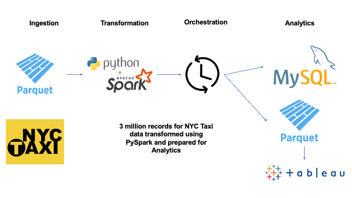

# **PySpark to MySQL Taxi Data Project (In-Development)**

**This project transforms 3 million records for Taxi Data in New York City using PySpark, and writes them to MySQL**


# **Overview**

The purpose of this project is to mimic a production-grade Extract, Transform & Load (ETL) Pipeline which uses parallel processing to
transform and write approximately 3 million records using PySpark, to a MySQL database

Data Engineers often have to use parallel processing when transforming large datasets and utlising Apache Spark is one such way to achieve this.

Spark works well with Python using the PySpark library, which is used for data transformation in this pipeline.

This project transforms a large dataset containing around 3 million records for Yellow Taxi Data in New York City, for the month of January 2025.

# Architecture 



The ingestion layer comprises of 3 million records related to Yellow Taxi data in New York City contained in a Parquet file.

At the transformation layer, data cleansing will occur via PySpark which will normalise data, perform rounding of numerical values, drop nulls and much more - you are also free to add your own transformations to the source code if you so wish.

At the analytics layer, there will be clean data ready for Business Intelligence, Machine Learning and reporting use-cases.

# Technologies Used:

**PySpark**

**MySQL 9.5**

**Python 3.9** (to use with Spark)

**Java 17** (to use with Spark)


# **Set Up:**

## **Part 1 - MySQL**

**Download MySQL Community Server 9.5.0 for your respective OS here:**

https://dev.mysql.com/downloads/mysql/

**Download MySQL Connector/J 9.5.0 (so Spark can connect to MySQL)**

https://dev.mysql.com/downloads/connector/j/

This is the Java (JDBC) connector for Spark to connect to MySQL

**Take note of where your MySQL Connector/J is located - we will need this later**


Once downloaded, go through the instructions and set up your ROOT user

You can also create a separate user if you so desire, but for the purposes of this project we'll be using Root

Once Root User and Password are set up, **please add the following to your PATH variables** 

* MySQL Version
* MySQL Root User
* MySQL Root Password

This process will vary depending on your OS system but this will allow us to use relative paths and avoid hard-coding credentials

**Create the database that our data will be written to**

Logged into your MySQL Workbench using the Root User, run the following command to create the database

````
CREATE DATABASE
yellow_taxi_database
````

## **Part 2 - Spark, Python, Java**

**Spark requires you to have a supported Java version installed (8, 11, 17 - version 17 has been used for this project)**

You can download the appropriate Java version here: https://www.java.com/en/

**We will also be using Python 3.9 in order for PySpark to work**

Please download Python 3.9 here: https://www.python.org/downloads/

**Please consult the following links to download Spark/setup Spark on your personal machine**

**Download Spark:** https://spark.apache.org/downloads.html

**Windows Spark Set Up:** https://www.youtube.com/watch?v=JjIwAMXUvYc

**Mac Spark Set Up:** https://www.youtube.com/watch?v=OGHyEXrvkF0

## Part 3 - Repo & Virtual Environment  ##

**1. Clone and/or fork this repository**

````
git clone https://github.com/jsthiara10/PySpark-Taxi-Data-Pipeline.git
````

**2. Setup a virtual environment, using **Python 3.9 (Important)****

To avoid dependency conflict, we'll be using a Virtual Environment

Open your IDE of choice and navigate to the project directory

Give your virtual environment an appropriate name, such as venv or spark39

````
python3.9 -m venv spark39
````

**Activate your virtual environment**

````
source spark39/bin/activate
````

**To deactivate your virtual environment, simply enter the following command**

````
deactivate
````

**3. Edit path to MySQL Java Connector - IMPORTANT**

In main.py, change the path of your MySQL Java Connector to that where it is installed on your personal machine

This is a crucial step, as Spark cannot directly connect to MySQL using Python modules

As Spark is Java-based, we'll be using such an appropriate JDBC driver


**4. Install the requirements for this pipeline**

In your virtual environment, install the requirements for this project (PySpark)

````
pip install -r requirements.txt
````
At the moment, this currently only has PySpark (as of 24th November 2025)

**5. Set up your data folders**

We'll be using relative paths for our Extract and Load processes

Still in your virtual environment, create the following folder

````
mkdir data
````

Switch to your data directory 

````
cd data
````

Then in the data folder, create the following directories

Our raw folder will contain the source Parquet file, whilst our clean folder will have a cleaned version of our Parquet file
written to it at the end of the ETL process

````
mkdir raw

mkdir clean
````


Switch back to your project directory

````
cd [your-project-directory]
````

**6. Drop the raw file into the raw folder**

Using the following link, **download the Parquet file** we will perform our ETL process on

https://www.nyc.gov/site/tlc/about/tlc-trip-record-data.page 

Scroll down and click on the link for **Yellow Taxi Trip Records for January 2025**, to download the Parquet file


Once you've downloaded the file, **drag & drop to the raw folder** (alternatively, download directly to raw folder)


**7. Run the pipeline**

In your terminal run the following command

````
python3 runner.py
````

This will allow our entry point to trigger the pipeline, which will transform 3 million records and write them to MySQL

**8. Validate that the data is written to MySQL**

In your SQL database, run the following command 

````
SELECT * FROM 
yellow_taxi_database.yellow_taxi_trips_jan_25
LIMIT 1000
````

**You should see some data that has been added to our table**


**You can also validate changes as per our specified transformations** 

For example, to ensure there's no rows with Passenger Count of 0, run the following command

````
SELECT COUNT (*) AS Zero_Passenger_Count FROM 
yellow_taxi_database.yellow_taxi_trips_jan_25 T1
WHERE
T1.passenger_count = 0
````

# **Future Improvements**

Future improvements may include adding an orchestration layer to automate the running of the pipeline

You are also welcome to add your own PySpark transformations and experiment with different file types and batch sizes

# **Contacts**

Like this application? Let's keep in touch!

Follow me here on GitHub: https://github.com/jsthiara10

Personal Portfolio: https://jsthiara10.github.io/

LinkedIn: https://www.linkedin.com/in/jasrajsinghthiara/

